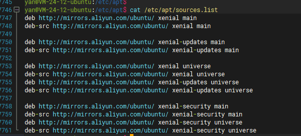

[TOC]
# 设置用户
## 开启 root 用户
腾讯云的 Ubuntu 系统默认用户名为 `ubuntu`，并且没有开启 `root` 用户；
而在一些设置时，有时候会需要使用到 `root` 用户，所以需要启用 `root` 用户（当然也可以将ubuntu 设置为 `root` 权限组）。
[启用root用户](https://cloud.tencent.com/document/product/1207/44569#ubuntu-.E7.B3.BB.E7.BB.9F.E5.A6.82.E4.BD.95.E4.BD.BF.E7.94.A8-root-.E7.94.A8.E6.88.B7.E7.99.BB.E5.BD.95.E5.AE.9E.E4.BE.8B.EF.BC.9F)方式在官方文档中具有详细描述，在此就不介绍

## 创建登录用户
一般情况下都我也不会直接使用 `root` 用户登录，会使用一个具有 `sudo` 权限的用户，类如 `ubuntu` 用户。
个人强迫症，我比较喜欢创建一个自己的用户，所以创建了一个新的用户，并没有使用 `ubuntu` 用户

* 创建用户
    > adduser [USER] 

* 赋予 sudo 权限
    > usermod -aG sudo [USER] 

此时便可以使用新用户登录


# 更换 apt 源
`apt` 是 Debian 及派生系统中的软件管理工具，在 Ubuntu 中主要就是使用此工具进行安装软件。

而腾讯云中 `apt` 软件源默认使用的是 http://mirrors.tencentyun.com/ubuntu/。 


不过腾讯云自己的源真的很拉跨。我使用时感觉超级慢，所以就将 `apt` 源 更换为阿里云。

`apt`源的配置文件为 `/etc/apt/sources.list`，只需要将此文件的地址更换为阿里云的即可。

当然如果感觉腾讯云速度可以接受，可以不更换 `apt` 源。 并且当然也可以更换为其它源。


1. 拷贝源文件 [可选]
   
    更改配置之前最好将源文件先拷贝一份，以防止出错。也可以不进行拷贝
    > sudo cp /etc/apt/sources.list /etc/apt/sources_tencentyun.list


2. 更新`/etc/apt/sources.list`中配置地址
   
    可以使用 `vim` 直接修改， 也可以使用`FTP`工具替换文件，怎么方便怎么来 
    ```
    deb http://mirrors.aliyun.com/ubuntu/ xenial main
    deb-src http://mirrors.aliyun.com/ubuntu/ xenial main

    deb http://mirrors.aliyun.com/ubuntu/ xenial-updates main
    deb-src http://mirrors.aliyun.com/ubuntu/ xenial-updates main

    deb http://mirrors.aliyun.com/ubuntu/ xenial universe
    deb-src http://mirrors.aliyun.com/ubuntu/ xenial universe
    deb http://mirrors.aliyun.com/ubuntu/ xenial-updates universe
    deb-src http://mirrors.aliyun.com/ubuntu/ xenial-updates universe

    deb http://mirrors.aliyun.com/ubuntu/ xenial-security main
    deb-src http://mirrors.aliyun.com/ubuntu/ xenial-security main
    deb http://mirrors.aliyun.com/ubuntu/ xenial-security universe
    deb-src http://mirrors.aliyun.com/ubuntu/ xenial-security universe

    ```
    

3. 更新源的配置文件
   
   执行命令更新配置
   > sudo apt-get update

4. 更新软件 [可选]
   
   执行命令更新本地软件包版本，此命令会将本地安装的软件与软件源列表软件进行对比，然后对低版本软件提示更新
   > sudo apt-get upgrade


