> 这一篇中主要是部署`Nginx`网关中心，用来代理服务器中服务，网关系统具有一定的优缺点，也可以不采用此方案

> 使用`Nginx`网关需要使用到域名，没有域名无法处理

[TOC]

上一篇中部署了基础环境，其中部署了一个 `Portainer`，这一篇，用来部署`Nginx网关` 代理 `Portainer`

# 什么是网关

`网关(Gateway)` 是转发其它服务器通信数据的服务器，接收客户端发送来的请求时，它就像自己拥有资源的源服务器一样对请求进行
处理。有时候客户端可能都不会察觉，自己的通信目标是一个网关。

以上是 `维基百科` 中对 `网关` 的描述。

`而 Nginx` 可以例如其代理机制实现 `网关`

本文中要做的是部署一台 `Nginx` 服务作为网关，此 `Nginx` 代理服务器中其它服务：例如 `Portainer`
服务器只暴露此 `Nginx网关`，`Nginx网关` 根据实际请求服务（根据域名区分）转发到对应服务。

这种 `Nginx` 网关设计访问具有一定的优点和缺点，

优点：

1.  可以对服务提供统一的管理，例如给服务统一设置 `HTTPS` 、 压缩等功能
2.  对于拥有公网 IP 不足，但具有多台服务器的场景，可以提供一种解决公网 IP 不足的方案

缺点：

1.  因为网关服务作为所有服务入口，那么网关承载了所有访问压力。
2.  对网关服务依赖性较强，当网关一挂掉，那所有的服务都处于都不可见状态。

> 这两个缺点可以对网关做负载均衡来解决。

`网关` 在系统基本上都随处可见，只是可能利用其它方案实现 `网关`。
例如后端微服务系统中便会提供一个网关，根据请求和服务器状态处理转发，

这玩意根据一定的业务场景来采用不同的解决方案。

在当前场景时，作为个人服务器，访问压力和服务器依赖性这问题都不需要考虑，而使用 `Nginx`网关则能更方便的提供 `HTTPS`和压缩等功能
所以就采用了这样的设计方案。

# Nginx

## 什么是 Nginx

`Nginx` 是一个高性能的**网页服务器**，也是目前使用最广泛的网页服务器之一。`Nginx` 也可以用作**反向代理**和**负载均衡**，

本文中`网关` 便是使用的 `Nginx` 中 **反向代理** 功能

`Nginx` 是一个很强大的服务器，我对他也仅仅会简单使用，有兴趣的朋友可以深入学习:[Nginx 开发从入门到精通](http://tengine.taobao.org/book/index.html)

## Nginx 部署

### Docker Compose 配置

因为要使用 `Portainer`可视化工具 ，`Docker Compose` 语法版本为 **2.X**。

```yml
version: '2.4'
services:
  nginx:
    image: nginx:latest
    container_name: gateway
    restart: always
    ports:
      - 80:80 #启动端口
      - 443:443
    volumes: #数据卷映射地址
      - /volumes/gateway/conf.d:/etc/nginx/conf.d
      - /volumes/gateway/nginx.conf:/etc/nginx/nginx.conf
      - /volumes/gateway/logs:/var/log/nginx
```

作为**网关服务**，监听端口 **80（HTTP）** 和端口 **443（HTTPS）**。

配置中使用 `volumes` 对 `Nginx` **日志** 、 **conf.d** 和 **nginx.conf（配置文件）** 挂载到宿主机

> PS：`Nginx` 容器读取配置文件的目录地址为 **/etc/nginx/nginx.conf**

其中 **nginx.conf** 为 _配置文件_， `Docker` 挂载文件时，宿主机中需要具有此文件，所以需要在服务器中先创建好该文件


### Nginx 文件

在 **nginx.conf** 配置文件中监听 **80** 端口，然后将请求转发给 **9000** 端口(`Portainer`可视化客户端)，也就是访问 **80**
端会被转发到 `Portainer`可视化客户端

```conf
events {
    worker_connections 1024;
}

http {
    include mime.types;
    default_type text/html;
    sendfile on;
    keepalive_timeout 65;
    charset utf-8;
    server {
        listen 80;
        location / {
            proxy_pass http://10.0.24.12:9000;
        }
    }

}
```

以上是简单的 **nginx.conf** 配置文件，用于监听 **80** 端口，用于以内网连接转发到 **9000** 端口，也可以使用容器的 **network** 连接

- events： 此模块用于处理 `Nginx` 连接的配置。 其中 **worker_connections** 属性表示最大并发数量
- http： 此模块用于处理 **HTTP** 监听配置，此模块中最重要是 **server** 属性，此属性表示 `虚拟服务器（站点）`，在 `虚拟服务器` 中可以监听端口，代理其它服务器或者挂载静态文件
  **serser 模块** 可以设置多个。
  - listen： 监听端口号
  * location：此属性用于匹配 _URL 请求_，在这里直接使用 **proxy_pass** 属性代理 **9000** 端口

> PS: 其它属性不熟悉的可以自行查询，都是些很简单的配置属性

此时便可以使用 `Portainer`可视化客户端启动

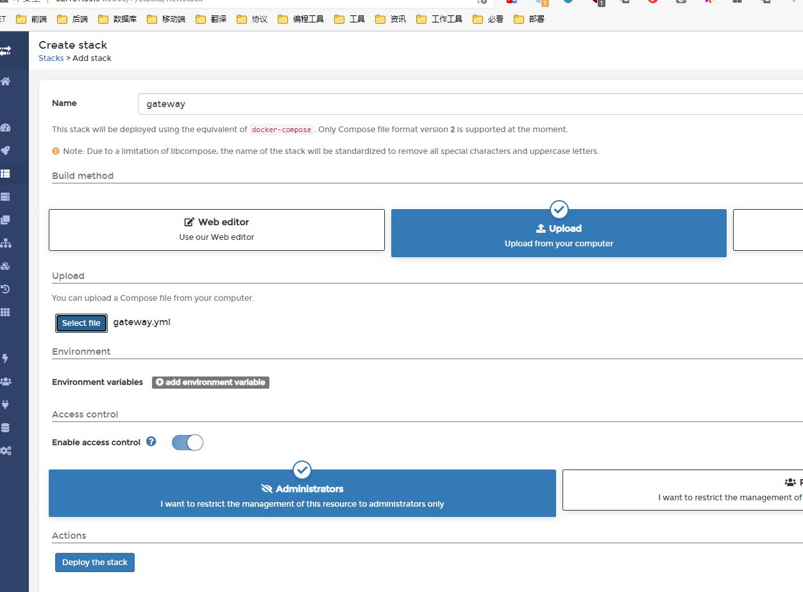

如果不出意外的话会顺利启动


此时，如果直接访问 **80** 端口的话便会访问到 `Portainer` 页面

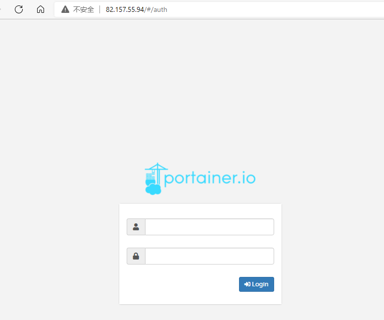

## Nginx 配置

### 压缩配置

`Nginx` 提供了强大的性能优化功能，其中最常见的就是压缩。

`Nginx` 中配置压缩也特别简单，只需要在 **nginx.conf** 文件中设置 **gzip** 相关属性即可

**gzip** 属性在 **http**、**server**、**location** 三个模块都可以设置，此服务用于网关，所以直接设置在 **http** 模块

```conf
http {
    include mime.types;
    default_type text/html;
    sendfile on;
    keepalive_timeout 65;
    charset utf-8;

    # 开启压缩
    # 压缩版本
    # 文件压缩类型
    gzip_types text/plain text/css application/javascript application/json application/xml;
    #设置压缩比率
    gzip_comp_level 5;
}
```

- gzip：是否开启 `ZIP` 压缩，该属性值可以设置为 **on** 或 **off**。

* gzip_type: 用于对匹配到的 `MIME` 类型文件进行压缩。其中 **text/html** 类型无论是否设置肯定会被压缩

* gzip_comp_level：设置 `GZIP` 压缩比，值的范围可以设置为：1-9，1：压缩比最小，处理最快；9：压缩比最大，处理最慢

在 **nginx.conf** 配置文件中添加 **gzip** 相关属性后，需要重新加载配置文件。

`Nginx` 中提供了重新加载配置文件命令 (**nginx -s reload**) 实现平滑更新。

> docker exec -it gateway nginx -s reload

重新加载之后可以分别访问 **80** 和 **9000** 端口，来测试文件大小和访问速度

- 9000
  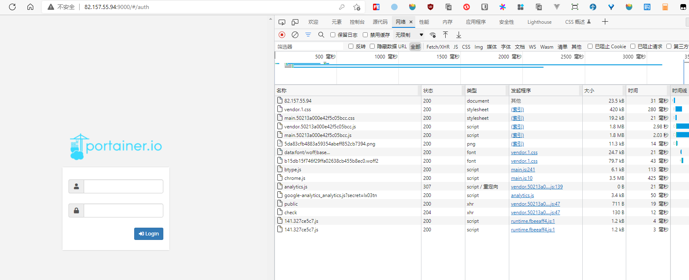

* 80
  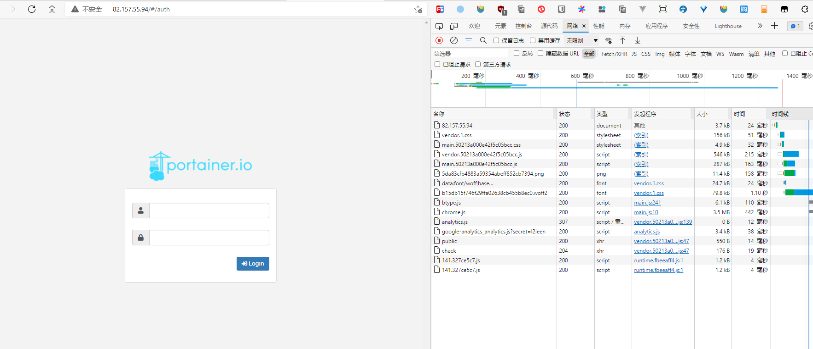

可以看到通过 `Nginx`网关代理压缩后的文件大小远远小于 **9000** 端口的，并且访问速度大大提高。这就是通过设置网关代理的好处之一

> PS：加载时注意要使用清空缓存并进行刷新
> PS：这时候可以将 服务器 **9000** 防火墙关闭，只使用网关访问

### server_name

在刚才使用了 `Nginx`网关监听 **80** 代理了 **9000** 端口，但其中具有一个很大的问题，那就是代理多个应用。`Nginx` 作为
一个网关，肯定要代理多个应用。

**server** 属性作为一个 `虚拟主机` 概念，可以使用多个 **server** 代理多个应用。
但是使用这种方式时。需要一个前置条件，判断具体请求的应用。解决这个问题就需要使用到 `Nginx` 中 **server_name** 属性和 **域名**

在 **server** 对象配置中有一个 **server_name** 属性，这个属性值会匹配请求中的 **host** 属性。当请求中的 **host** 属性匹配 **service_name** 属性值，
那么就执行此 **server** 业务

通过 **server_name** 和不同的域名，两者可以决定真实的请求应用。

域名需要备案，需要时间，不过也很简单。域名本身也不贵。我具有一个已经备过案的域名： **mwjz.live** 。

购买的域名会部署主站，而像 `Portainer` 这些应用则可以分配到子域名中。子域名不需要付费，在云应用厂商中直接配置解析规则即可。

我的域名时是在 腾讯云 中购买的，在腾讯云已购买域名中配置子域名解析规则即可

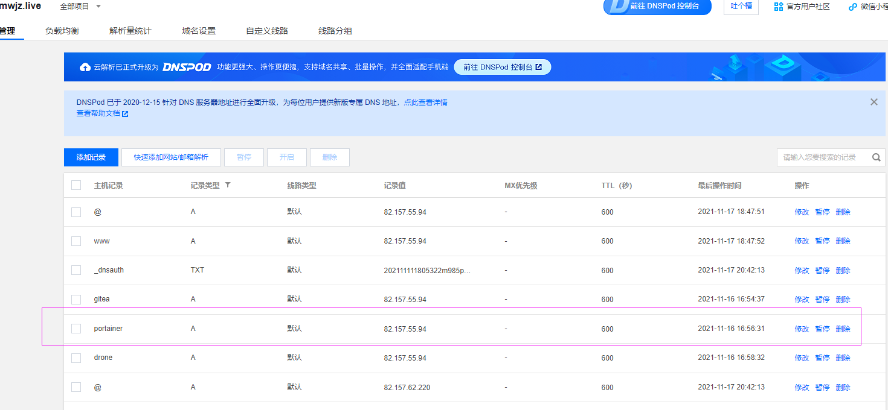

我配置了一个 _portainer_ 子域名给 `Portainer`应用。 完整的子域名是 **portainer.mwjz.live**

> PS：当刚配置完域名解析，会有一段时间的延迟

在 **nginx.conf** 中可以将 **portainer.mwjz.live** 配置于 **server_name**

```conf
server {
    listen 80;
    server_name portainer.mwjz.live;
    location / {
        proxy_pass http://10.0.24.12:9000;
    }
}

```

执行 reload，就可以使用域名访问

> docker exec -it gateway nginx -s reload

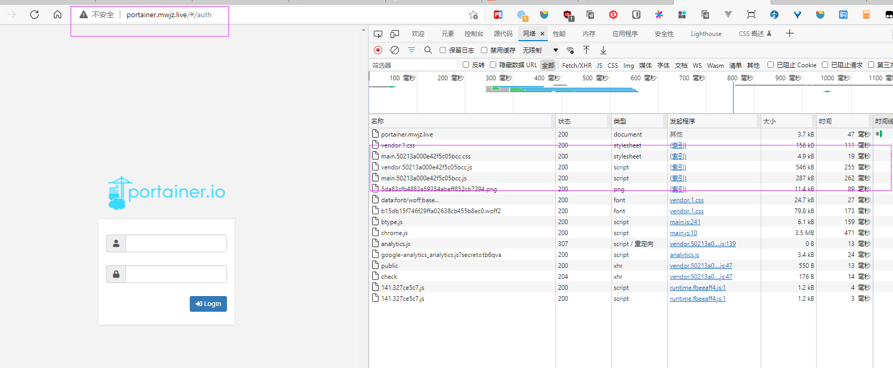

可以看到访问 **portainer.mwjz.live** 就可以访问到 `Portainer` 客户端，并且根据文件大小可以判断当前为 `Nginx` 网关代理的。

同理多个应用可以配置多个 **server**，只需要配置不同的 **server_name**。

### HTTPS 和 HTTP2

#### HTTPS 证书

在当今时代 网站基本上都已经使用 `HTTPS` 了。
`HTTPS` 需要申请证书，证书可以在 云服务器厂商中免费申请。申请也极为简单。

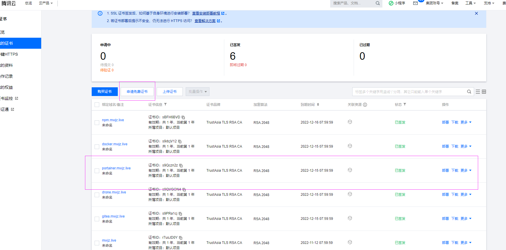

申请成功后下载 `Nginx` 版本然证书后上传服务器使用。

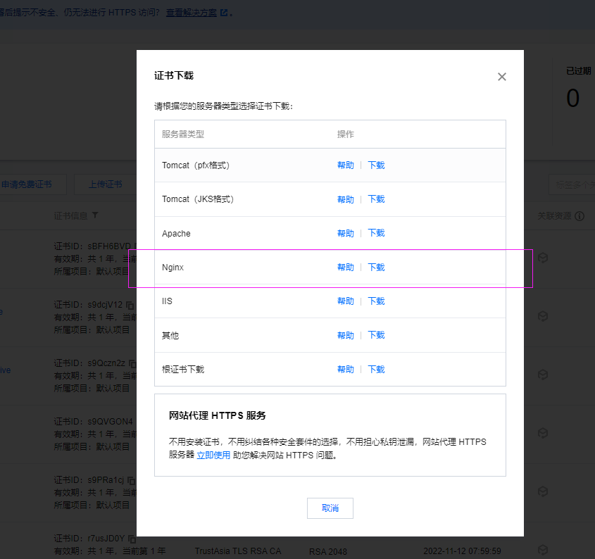

在此将证书上传到了 **/volumes/gateway/conf.d/ssl/portainer/** 目录。


因为配置 `Nginx` 网关时，将 **/etc/nginx/conf.d** 挂载到宿主机 **/volumes/gatewal/conf.d** 目录，
所以也相当于存放在 `Nginx`容器的 **/etc/nginx/conf.d/ssl/portainer/** 目录。

#### Nginx 配置 HTTPS

```conf
server {
    #SSL 访问端口号为 443
    listen 443 ssl;
    #填写绑定证书的域名
    server_name portainer.mwjz.live;
    #证书文件
    ssl_certificate /etc/nginx/conf.d/ssl/portainer/portainer.mwjz.live_bundle.crt;
    #证书密钥文件
    ssl_certificate_key /etc/nginx/conf.d/ssl/portainer/portainer.mwjz.live.key;

    ssl_ciphers SHA256:ECDHE:ECDH:AES:HIGH:!NULL:!3DES:!aNULL:!MD5:!ADH:!RC4;
    ssl_protocols TLSv1 TLSv1.1 TLSv1.2;
    ssl_prefer_server_ciphers on;
    location / {
        proxy_pass http://10.0.24.12:9000;
    }
}
server {
    listen 80;
    #填写绑定证书的域名
    server_name portainer.mwjz.live;
    location / {
        proxy_pass http://10.0.24.12:9000;
    }
}

```

`HTTPS` 端口为 **443**

在监听端口后加上 **SSL** 表示开启 `HTTPS`

> 开启 **SSL**，必须提供证书文件

- ssl_certificate: 提供给虚拟服务器的 `PEM` 格式证书

* ssl_certificate_key: 提供给虚拟服务器的 `PEM` 格式证书的的密钥
* ssl_ciphers: 首选加密套件
* ssl_protocols: 允许的加密协议
* ssl_prefer_server_ciphers: 指定在使用 SSLv3 和 TLS 协议时，服务器密码应优先于客户端密码。

更新配置文件后进行重新加载

> docker exec -it gateway nginx -s reload

此时便可以使用 `HTTPS` 协议访问


#### HTTP 跳转 HTTPS

现在各大网站使用 `HTTPS` 协议后，使用 `HTTP` 访问时会返回 **307**，然后切换为 `HTTPS` 协议访问。

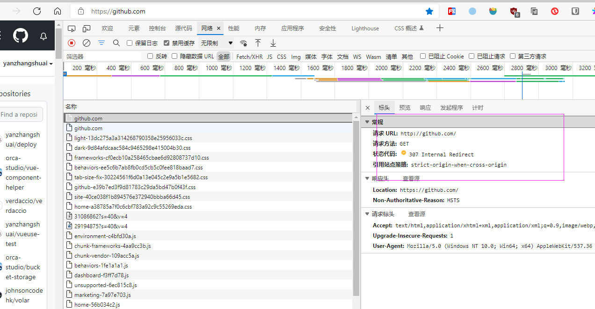

以上是使用 `HTTP` 协议访问 `Github`，可以看到返回了一个 **307**，随后就跳转 `HTTPS` 协议了。

这个操作其实很简单，只需要将 **80** 端口返回 **307** 和对应的地址。

```conf

server {
    #SSL 访问端口号为 443
    listen 443 ssl;
    #填写绑定证书的域名
    server_name portainer.mwjz.live;
    #证书文件
    ssl_certificate /etc/nginx/conf.d/ssl/portainer/portainer.mwjz.live_bundle.crt;
    #证书密钥文件
    ssl_certificate_key /etc/nginx/conf.d/ssl/portainer/portainer.mwjz.live.key;

    ssl_ciphers SHA256:ECDHE:ECDH:AES:HIGH:!NULL:!3DES:!aNULL:!MD5:!ADH:!RC4;
    ssl_protocols TLSv1 TLSv1.1 TLSv1.2;
    ssl_prefer_server_ciphers on;
    location / {
        proxy_pass http://10.0.24.12:9000;
    }
}
server {
    listen 80;
    return 307 https://$host$request_uri;
}
```

在 **80** 端口的 `虚拟主机` 中返回 **307** 状态码和 `HTTPS` 协议的请求。
此时将所有的 **80** 请求转成 **443**，在之后添加其它应用时只需要设置 **443** 端口即可

> $host： 请求的 host参数。$request_uri：请求的路由地址

此时使用 `HTTP` 协议请求 `Portainer` 便也会返回 **307**，随后使用 `HTTPS` 协议请求。

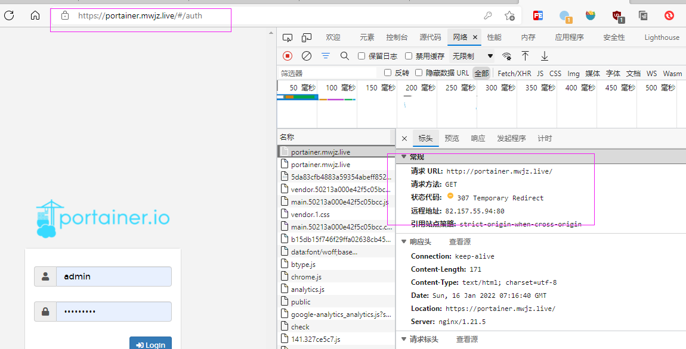

#### HTTP2

`Nginx` 配置 `HTTP2` 很简单，只需要在 监听端口号后添加 **http2** 标识

```conf
server {
    #SSL 访问端口号为 443
    listen 443 ssl http2;
    #填写绑定证书的域名
    server_name portainer.mwjz.live;
    #证书文件
    ssl_certificate /etc/nginx/conf.d/ssl/portainer/portainer.mwjz.live_bundle.crt;
    #证书密钥文件
    ssl_certificate_key /etc/nginx/conf.d/ssl/portainer/portainer.mwjz.live.key;

    ssl_ciphers SHA256:ECDHE:ECDH:AES:HIGH:!NULL:!3DES:!aNULL:!MD5:!ADH:!RC4;
    ssl_protocols TLSv1 TLSv1.1 TLSv1.2;
    ssl_prefer_server_ciphers on;
    location / {
        proxy_pass http://10.0.24.12:9000;
    }
}
```

重新加载配置文件后再访问 `Portainer` 便可以看到相应为 `HTTP2`

> docker exec -it gateway nginx -s reload

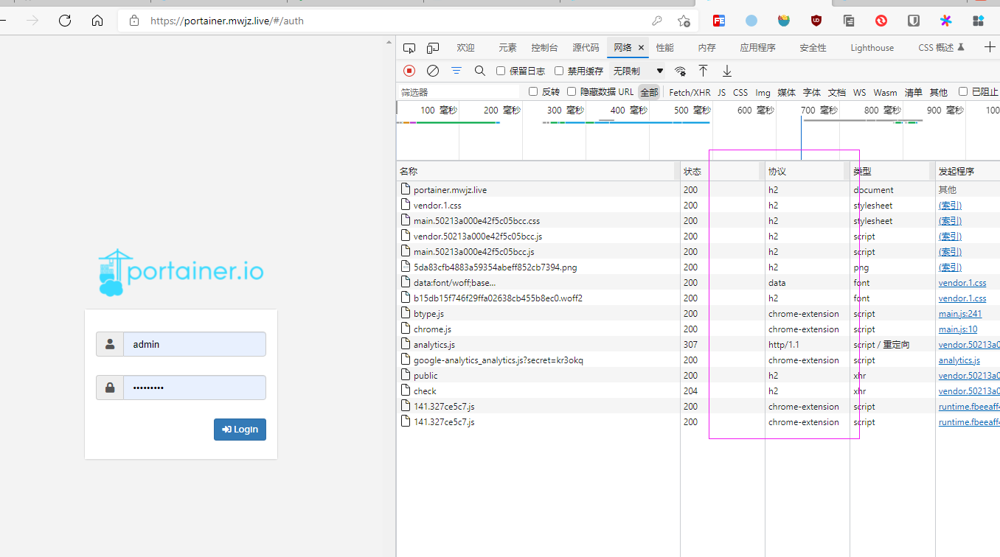

> PS：如果没有 **协议** 选项，使用右键打开

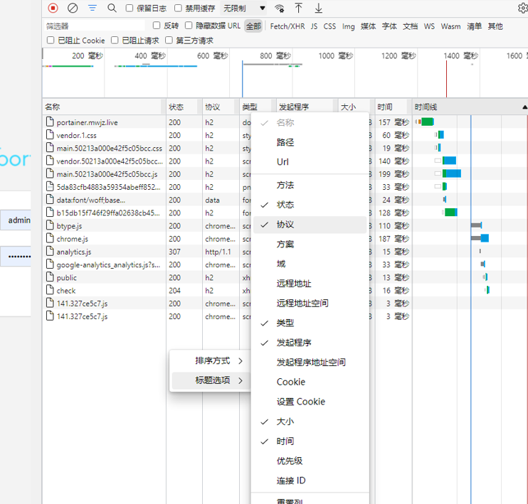
